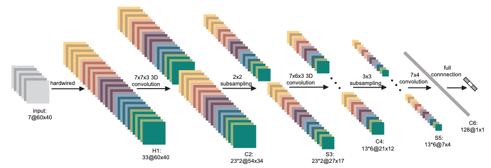

# CS570



## 0. Requirements

CUDA version : 11.8


## 1. Download the dataset.

```
cd datasets
python kth_download.py

mkdir utdmad
cd utdmad
wget http://www.utdallas.edu/~kehtar/UTD-MAD/RGB.zip
unzip RGB.zip

cd ..
```

Make the downloaded file in the folder kth. As ./kth/boxing/person01_boxing_d1_uncomp.avi.
For the UTD-MHAD dataset, we have to set the data folder as cs570/datasets/utdmad/RGB/a1_s1_t1_color.avi.

## 2. Run the model

```
python run.py
python run_utdmad.py --dataset_dir=utdmad-data-aux
```

### KTH Dataset

@inproceedings{inproceedings,
author = {Roth, Peter M. and Mauthner, Thomas and Khan, Inayatullah and Bischof, Horst},
year = {2009},
month = {11},
pages = {546 - 553},
title = {Efficient human action recognition by cascaded linear classifcation},
doi = {10.1109/ICCVW.2009.5457655}
}

### UTD-MHAD Dataset
https://personal.utdallas.edu/~kehtar/UTD-MHAD.html